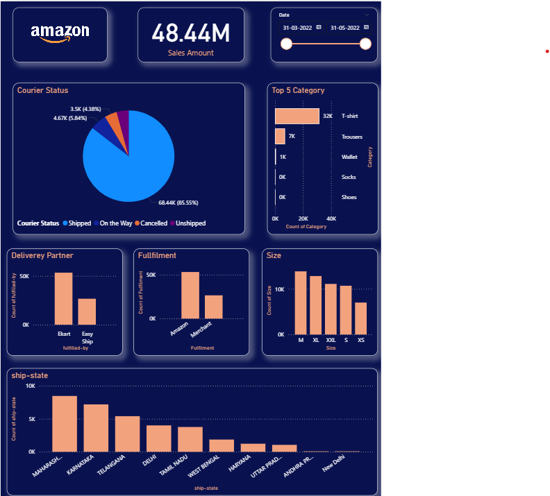
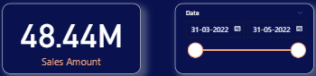
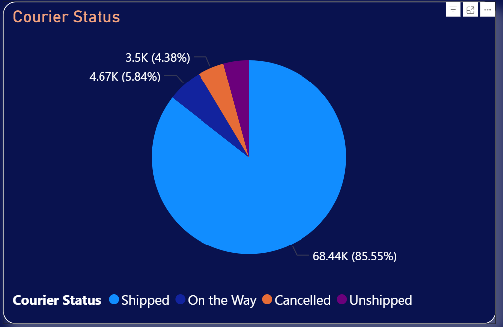
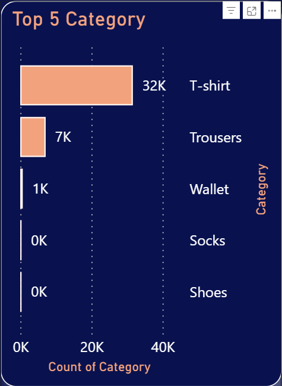
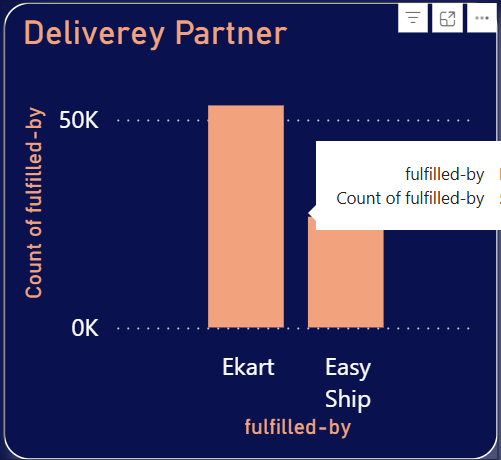
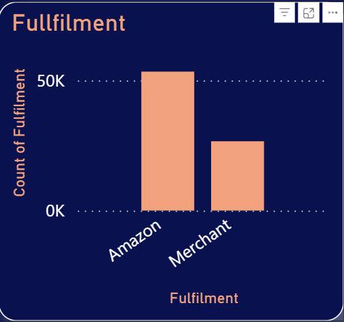
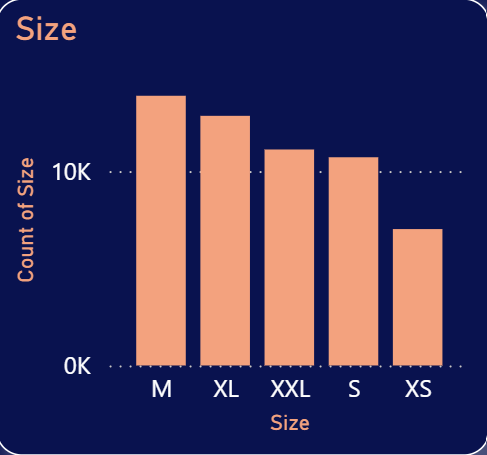
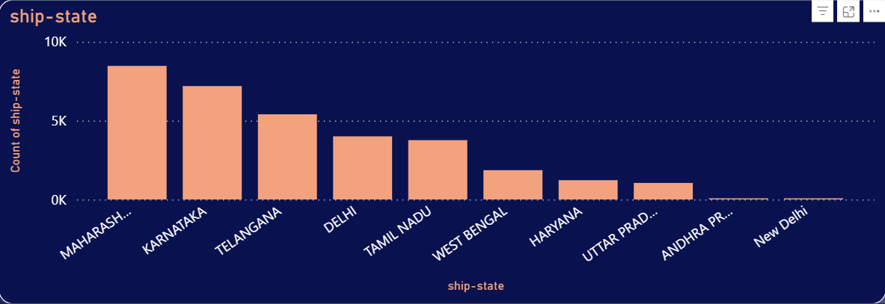

# 📊 Amazon Sales Dashboard – Power BI

## 📌 Overview
This Power BI dashboard analyzes Amazon sales performance across multiple dimensions — product categories, regions, courier statuses, and fulfillment types.  
The project involved **data cleaning in Power Query** and building **interactive visualizations** to answer key business questions.

---

## 🛠 Data Cleaning Steps
Performed in Power Query:
- Removed duplicates
- Handled missing values
- Standardized category names
- Converted data types (dates, numbers, currency)
- Filtered relevant time periods

---

## 📊 KPIs & Metrics
- **Total Sales Amount**: 48.44M (for selected period: 31-03-2022 to 31-05-2022)
- **Courier Status**: Shipped, On the Way, Cancelled, Unshipped
- **Top 5 Product Categories**: T-shirt, Wallet, Trousers, Socks, Shoes
- **Top Delivery Partners**: Ekart, Easy Ship
- **Fulfillment Types**: Amazon Fulfilled, Merchant Fulfilled
- **Product Sizes**: M, XL, XXL, S, XS
- **Ship-State Distribution**: Maharashtra, Karnataka, Telangana, Delhi, etc.

---

## 📈 Visuals

### 1. Dashboard Overview

### 2. KPI – Total Sales Amount & Date Slicer

### 3. Courier Status Breakdown

### 4. Top 5 Product Categories

### 5. Delivery Partner Performance

### 6. Fulfillment Type

### 7. Product Size Distribution

### 8. Ship-State Analysis

---

## ❓ Business Questions Answered
- What is the total sales amount during the selected period?
- Which courier status has the highest share of orders?
- Which product categories contribute most to sales?
- Which delivery partner is most used?
- How does fulfillment type affect order distribution?
- Which product sizes are most popular?
- Which states generate the most orders?

---

## 🚀 How to Use
1. Download the `.pbix` file from this repository.
2. Open it in **Power BI Desktop**.
3. Explore the dashboard using filters and slicers.

---

## 🗂 Data Source
Sample Amazon sales dataset (anonymized for demonstration purposes).

---

## 👤 Author
**Darshan GM**

---
